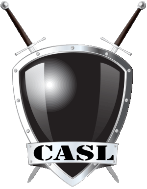

# STOP WAR IN UKRAINE!

## [All the truth about war in UKRAINE](https://dearrussian.wtf/)

<p align="center">
  <a href="https://stalniy.github.io/casl/" target="_blank" rel="noopener noreferrer"></a>

[](https://opencollective.com/casljs)

[](https://codecov.io/gh/stalniy/casl)
[](https://gitter.im/stalniy-casl/casl)
<!-- [](https://codeclimate.com/github/stalniy/casl) -->
</p>

CASL (pronounced /ˈkæsəl/, like **castle**) is an isomorphic authorization JavaScript library which restricts what resources a given user is allowed to access. It's designed to be incrementally adoptable and can easily scale between a simple claim based and fully featured subject and attribute based authorization. It makes it easy to manage and share permissions across UI components, API services, and database queries.

Heavily inspired by [cancan](https://github.com/CanCanCommunity/cancancan).

## Features

* **Versatile**\
  An incrementally adoptable and can easily scale between a simple claim based and fully featured subject and attribute based authorization.
* **Isomorphic**\
  Can be used on frontend and backend and complementary packages make integration with major Frontend Frameworks and Backend ORMs effortless
* **TypeSafe**\
  Written in TypeScript, what makes your apps safer and developer experience more enjoyable
* **Tree shakable**\
  The core is only 6KB mingzipped and can be even smaller!
* **Declarative**\
  Thanks to declarative rules, you can serialize and share permissions between UI and API or microservices

## Ecosystem

| Project           | Status                               | Description | Supported envinronemnts |
|-------------------|--------------------------------------|-------------|-------------------------|
| [@casl/ability]   | [![@casl/ability-status]][@casl/ability-package]   | CASL's core package | nodejs 8+ and ES5 compatible browsers (IE 9+) |
| [@casl/mongoose]  | [![@casl/mongoose-status]][@casl/mongoose-package] | integration with [Mongoose][mongoose] | nodejs 8+ |
| [@casl/prisma]  | [![@casl/prisma-status]][@casl/prisma-package] | integration with [Prisma][prisma] | nodejs 12+ |
| [@casl/angular]   | [![@casl/angular-status]][@casl/angular-package]   | integration with  [Angular][angular] | IE 9+ |
| [@casl/react]     | [![@casl/react-status]][@casl/react-package]       | integration with  [React][react] | IE 9+ |
| [@casl/vue]       | [![@casl/vue-status]][@casl/vue-package]           | integration with  [Vue][vue] | IE 11+ (uses `WeakMap`) |
| [@casl/aurelia]   | [![@casl/aurelia-status]][@casl/aurelia-package]   | integration with  [Aurelia][aurelia] | IE 11+ (uses `WeakMap`) |

[@casl/ability]: packages/casl-ability
[@casl/mongoose]: packages/casl-mongoose
[@casl/prisma]: packages/casl-prisma
[@casl/angular]: packages/casl-angular
[@casl/react]: packages/casl-react
[@casl/vue]: packages/casl-vue
[@casl/aurelia]: packages/casl-aurelia

[@casl/ability-status]: https://img.shields.io/npm/v/@casl/ability.svg
[@casl/mongoose-status]: https://img.shields.io/npm/v/@casl/mongoose.svg
[@casl/prisma-status]: https://img.shields.io/npm/v/@casl/prisma.svg
[@casl/angular-status]: https://img.shields.io/npm/v/@casl/angular.svg
[@casl/react-status]: https://img.shields.io/npm/v/@casl/react.svg
[@casl/vue-status]: https://img.shields.io/npm/v/@casl/vue.svg
[@casl/aurelia-status]: https://img.shields.io/npm/v/@casl/aurelia.svg

[@casl/ability-package]: https://www.npmjs.com/package/@casl/ability
[@casl/mongoose-package]: https://www.npmjs.com/package/@casl/mongoose
[@casl/prisma-package]: https://www.npmjs.com/package/@casl/prisma
[@casl/angular-package]: https://www.npmjs.com/package/@casl/angular
[@casl/react-package]: https://www.npmjs.com/package/@casl/react
[@casl/vue-package]: https://www.npmjs.com/package/@casl/vue
[@casl/aurelia-package]: https://www.npmjs.com/package/@casl/aurelia

## Documentation

A lot of detailed information about CASL, integrations and examples can be found in [documentation].

## Have a question?

Ask it in [chat](https://gitter.im/stalniy-casl/casl) or on [stackoverflow](https://stackoverflow.com/questions/tagged/casl). Please don't ask questions in issues, the issue list of this repo is **exclusively** for bug reports and feature requests. Questions in the issue list may be closed immediately without answers.

## CASL crash course

CASL operates on the abilities level, that is what a user can actually do in the application. An ability itself depends on the 4 parameters (last 3 are optional):

1. User Action\
   Describes what user can actually do in the app. User action is a word (usually a verb) which depends on the business logic (e.g., `prolong`, `read`). Very often it will be a list of words from CRUD - `create`, `read`, `update` and `delete`.
2. Subject\
   The subject or subject type which you want to check user action on. Usually this is a business (or domain) entity name (e.g., `Subscription`, `BlogPost`, `User`).
3. Conditions\
   An object or function which restricts user action only to matched subjects. This is useful when you need to give a permission on resources created by a user (e.g., to allow user to update and delete own `BlogPost`)
4. Fields\
   Can be used to restrict user action only to matched subject's fields (e.g., to allow moderator to update `hidden` field of `BlogPost` but not update `description` or `title`)

Using CASL you can describe abilities using regular and inverted rules. Let's see how

**Note:** all the examples below will be written in TypeScript but CASL can be used in similar way in ES6+ and Nodejs environments.

### 1. Define Abilities

Lets define `Ability` for a blog website where visitors:
* can read blog posts
* can manage (i.e., do anything) own posts
* cannot delete a post if it was created more than a day ago

```ts
import { AbilityBuilder, createMongoAbility } from '@casl/ability'
import { User } from '../models'; // application specific interfaces

/**
 * @param user contains details about logged in user: its id, name, email, etc
 */
function defineAbilitiesFor(user: User) {
  const { can, cannot, build } = new AbilityBuilder(createMongoAbility);

  // can read blog posts
  can('read', 'BlogPost');
  // can manage (i.e., do anything) own posts
  can('manage', 'BlogPost', { author: user.id });
  // cannot delete a post if it was created more than a day ago
  cannot('delete', 'BlogPost', {
    createdAt: { $lt: Date.now() - 24 * 60 * 60 * 1000 }
  });

  return build();
});
```

Do you see how easily business requirements were translated into CASL's rules?

**Note**: you can use class instead of string as a subject type (e.g., `can('read', BlogPost)`)

And yes, `Ability` class allow you to use some MongoDB operators to define conditions. Don't worry if you don't know MongoDB, it's not required and explained in details in [Defining Abilities][define-abilities]

### 2. Check Abilities

Later on you can check abilities by using `can` and `cannot` methods of `Ability` instance.

```js
// in the same file as above
import { ForbiddenError } from '@casl/ability';

const user = getLoggedInUser(); // app specific function
const ability = defineAbilitiesFor(user);

class BlogPost { // business entity
  constructor(props) {
    Object.assign(this, props);
  }
}

// true if ability allows to read at least one Post
ability.can('read', 'BlogPost');
// the same as
ability.can('read', BlogPost);

// true, if user is the author of the blog post
ability.can('manage', new BlogPost({ author: user.id }));

// true if there is no ability to read this particular blog post
const ONE_DAY = 24 * 60 * 60 * 1000;
const postCreatedNow = new BlogPost({ createdAt: new Date() });
const postCreatedAWeekAgo = new BlogPost({ createdAt: new Date(Date.now() - 7 * ONE_DAY) });

// can delete if it's created less than a day ago
ability.can('delete', postCreatedNow); // true
ability.can('delete', postCreatedAWeekAgo); // false

// you can even throw an error if there is a missed ability
ForbiddenError.from(ability).throwUnlessCan('delete', postCreatedAWeekAgo);
```

Of course, you are not restricted to use only class instances in order to check permissions on objects. See [Introduction][intro] for the detailed explanation.

### 3. Database integration

CASL has a complementary package [@casl/mongoose] which provides easy integration with MongoDB and [mongoose].

```ts
import { accessibleRecordsPlugin } from '@casl/mongoose';
import mongoose from 'mongoose';

mongoose.plugin(accessibleRecordsPlugin);

const user = getUserLoggedInUser(); // app specific function

const ability = defineAbilitiesFor(user);
const BlogPost = mongoose.model('BlogPost', mongoose.Schema({
  title: String,
  author: mongoose.Types.ObjectId,
  content: String,
  createdAt: Date,
  hidden: { type: Boolean, default: false }
}))

// returns mongoose Query, so you can chain it with other conditions
const posts = await BlogPost.accessibleBy(ability).where({ hidden: false });

// you can also call it on existing query to enforce permissions
const hiddenPosts = await BlogPost.find({ hidden: true }).accessibleBy(ability);

// you can even pass the action as a 2nd parameter. By default action is "read"
const updatablePosts = await BlogPost.accessibleBy(ability, 'update');
```

See [Database integration][database-integration] for details.

### 4. Advanced usage

**CASL is incrementally adoptable**, that means you can start your project with simple claim (or action) based authorization and evolve it later, when your app functionality evolves.

**CASL is composable**, that means you can implement alternative conditions matching (e.g., based on [joi], [ajv] or pure functions) and field matching (e.g., to support alternative syntax in fields like `addresses.*.street` or `addresses[0].street`) logic.

See [Advanced usage][advanced-usage] for details.

[joi]: https://www.npmjs.com/package/@hapi/joi
[ajv]: https://www.npmjs.com/package/ajv

### 5. Examples

Looking for examples? Check [CASL examples](https://github.com/stalniy/casl-examples) repository.

## Want to help?

Want to file a bug, contribute some code, or improve documentation? Excellent! Read up on guidelines for [contributing].

If you'd like to help us sustain our community and project, consider [to become a financial contributor on Open Collective](https://opencollective.com/casljs/contribute)

## Contributors

### Code Contributors

This project exists thanks to all the people who contribute. [[Contribute](CONTRIBUTING.md)].
<a href="https://github.com/stalniy/casl/graphs/contributors"></a>

### Financial Contributors

Become a financial contributor and help us sustain our community. [[Contribute](https://opencollective.com/casljs/contribute)]

#### Individuals

<a href="https://opencollective.com/casljs"></a>

#### Organizations

Support this project with your organization. Your logo will show up here with a link to your website. [[Contribute](https://opencollective.com/casljs/contribute)]

<a href="https://opencollective.com/casljs/organization/0/website"></a>
<a href="https://opencollective.com/casljs/organization/1/website"></a>
<a href="https://opencollective.com/casljs/organization/2/website"></a>
<a href="https://opencollective.com/casljs/organization/3/website"></a>
<a href="https://opencollective.com/casljs/organization/4/website"></a>
<a href="https://opencollective.com/casljs/organization/5/website"></a>
<a href="https://opencollective.com/casljs/organization/6/website"></a>
<a href="https://opencollective.com/casljs/organization/7/website"></a>
<a href="https://opencollective.com/casljs/organization/8/website"></a>
<a href="https://opencollective.com/casljs/organization/9/website"></a>

## License

[MIT License](http://www.opensource.org/licenses/MIT)

Copyright (c) 2017-present, Sergii Stotskyi

[contributing]: https://github.com/stalniy/casl/blob/master/CONTRIBUTING.md
[define-abilities]: https://stalniy.github.io/casl/en/guide/define-rules
[intro]: https://stalniy.github.io/casl/en/guide/intro
[database-integration]: https://stalniy.github.io/casl/en/package/casl-mongoose
[documentation]: https://stalniy.github.io/casl/
[advanced-usage]: https://stalniy.github.io/casl/en/advanced/customize-ability

[mongoose]: http://mongoosejs.com/
[vue]: https://vuejs.org
[angular]: https://angular.io/
[react]: https://reactjs.org/
[aurelia]: http://aurelia.io
[prisma]: https://www.prisma.io/
