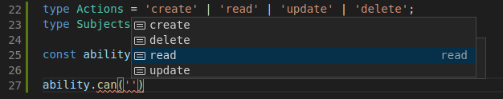
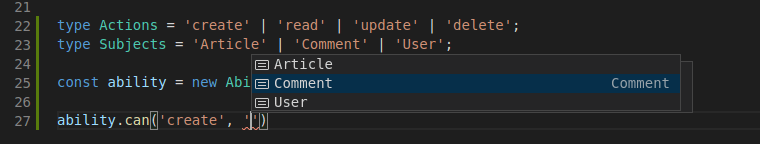
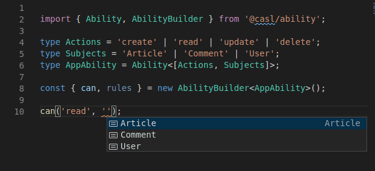
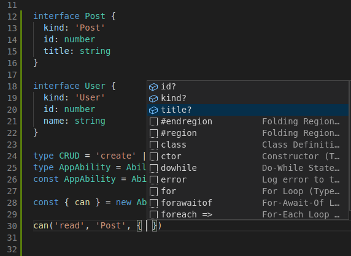
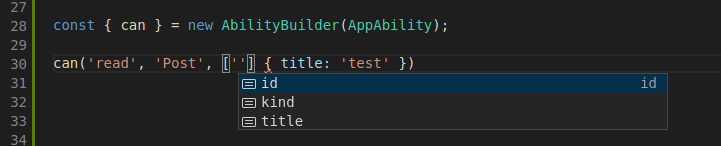

CASL is written in [TypeScript] and this brings several benefits:
* better safety as you can control what actions and subjects can be used
* better IDE integration as you can get hints on what classes you can use and arguments you need to pass inside
* easier library support, we can forgot about synchronization issues between `.d.ts` and `.js` files

[TypeScript]: https://typescriptlang.org/

So, let's play around with them

> Minimum supported TypeScript version is **3.5.3**

## Permissions inference

`Ability` class accepts 2 **optional** generic parameters:

```ts
import { Ability, Subject, MongoQuery } from '@casl/ability';

type PossibleAbilities = [string, Subject];
type Conditions = MongoQuery;

const ability = new Ability<PossibleAbilities, Conditions>();
```

> `Subject` is a special type that represents all possible subjects that `Ability` can accept. So, it's `object | string | Function | undefined`.

Don't be scared by the complexity, `Ability` uses that types by default, so the example above is the same as the one below:

```ts
import { Ability } from '@casl/ability';

const ability = new Ability();
```

These types are enough to protect you from passing wrong arguments but you can go further and make them even stricter. To illustrate how, let's consider a blog application, which has `User`, `Article` and `Comment` entities with the next user's permissions:

* can `create`, `update`, `delete` own `Article` or `Comment`
* can `read` any `Article`, any `Comment` and any `User`

So, let's translate this to CASL by specifying all possible actions and all possible subjects as generic parameters:

```ts
import { Ability } from '@casl/ability';

type Actions = 'create' | 'read' | 'update' | 'delete';
type Subjects = 'Article' | 'Comment' | 'User';

const ability = new Ability<[Actions, Subjects]>();
```

If you try to type `ability.can(` in [VSCode] (or other TypeScript supported IDEs), it provides hints:

[VSCode]: https://code.visualstudio.com/



The same happens when you try to specify the 2nd argument:



The same behavior works for `AbilityBuilder` and `defineAbility` function:



## Infer subject types from interfaces and classes

You can also specify interfaces as subjects:

```ts
import { Ability } from '@casl/ability';

interface Article {
  id: number
  title: string
  content: string
  authorId: number
}

interface User {
  id: number
  name: string
}

interface Comment {
  id: number
  content: string
  authorId: number
}

type Action = 'create' | 'read' | 'update' | 'delete';
type Subject = Article | Comment | User | 'Article' | 'User' | 'Comment';

const ability = new Ability<[Action, Subject]>();

ability.can('read', 'Article');
ability.can('write', 'Article'); // error because non-existing action name
ability.can('update', 'Coment') // error because of typo
```

and classes:

```ts
import { Ability } from '@casl/ability';

class Article {
  id: number
  title: string
  content: string
  authorId: number
}

type Action = 'create' | 'read' | 'update' | 'delete';
type Subject = typeof Article | Article;

const ability = new Ability<[Action, Subject]>();

ability.can('read', Article);
ability.can('update', new Article());
```

This may be a bit routine to specify all possible subject types, especially if you have more than 3 of them. To make it easier, CASL provide `InferSubjects` typescript helper which can infer subjects from [tagged union]s (this helper checks `kind` and special `__caslSubjectType__` properties in order to determine the tag)

[tagged union]: https://www.typescriptlang.org/docs/handbook/advanced-types.html#discriminated-unions

> `__caslSubjectType__` is set by `subject` helper, to learn more check [Subject type detection](../../guide/subject-type-detection)


classes


and even discriminated classes (you need to pass `true` to the 2nd generic parameter of `InferSubjects`).


The same parameter allows to infer `modelName` static property from classes (in case you want to use strings and not classes to check on subject type)


Moreover, the same behavior also works in complementary packages! So, you will get hints for React's `Can` component, Vue's `$can` function, Mongoose's plugins and others.

> To learn more, read docs for a complementary package for of your choice

But even this is not the end and you can go even further!

## Safer permissions inference

For the most cases the suggested approach above should be enough but if you prefer to ensure extreme type safety, you can define dependencies between actions and subjects. For example, user can only read information about users in your app and nothing more but can manage articles:

```ts
import { Ability } from '@casl/ability';

type CRUD = 'create' | 'read' | 'update' | 'delete';
type Abilities = ['read', 'User'] | [CRUD, 'Article'];

const ability = new Ability<Abilities>();

ability.can('read', 'User');
ability.can('create', 'User'); // build time error! because it's not allowed to create users
```

## Application Ability

From the first sight, it looks like that in order to use safer generic parameters, your app's code will become more complicated and this is true. But there is an escape hatch - **Companion object pattern**:

```ts
import { Ability, AbilityClass } from '@casl/ability';

type CRUD = 'create' | 'read' | 'update' | 'delete';
type Abilities = ['read', 'User'] | [CRUD, 'Article'];

export type AppAbility = Ability<Abilities>;
export const AppAbility = Ability as AbilityClass<AppAbility>;
```

This simple pattern comes to TypeScript from Scala, and it's a way to pair together types and objects. In TypeScript, values and types live in a separate namespaces, this allows to use the same name for a type and a class. TypeScript understands which one to use baed on the context.

## AbilityBuilder type inference

`AbilityBuilder` constructor accepts the single argument which is a type of `Ability` we want to build:

```ts
import { AbilityBuilder, Ability } from '@casl/ability';

const builder = new AbilityBuilder(Ability);
```

> Starting from v5, `AbilityBuilder` accepts required parameter, `Ability` class to build

Thanks to this `AbilityBuilder` can infer all needed types from `Ability` types. This is especially useful when we define `AppAbility` because then we will have IDE hints and type safety for:

* specified action
* specified subject type
* **properties used in conditions**
* **specified fields**

We can use either tagged interfaces (supports `kind`, `__typename` and `__caslSubjectType__` tag fields) or classes:





The cool thing is that all that safety is subject type dependent! Try to pass `User` subject type in place of `Post` and see it by yourself!

### Nested fields with dot notation

If we need to define conditions based on nested fields, we can do this by defining a separate interface:

```ts
import { Ability, AbilityClass } from '@casl/ability';

interface User {
  kind: 'User'
  id: number
  name: string
  address: {
    street: string
    building: string
  }
}

type AppAbility = Ability<['read', User | 'User']>;
const AppAbility = Ability as AbilityClass<AppAbility>;

const { can } = new AbilityBuilder(AppAbility);

type FlatUser = User & {
  'address.street': User['address']['street']
};

can<FlatUser>('read', 'Post', { 'address.street': 'test' });
// It also works for fields
can<FlatUser>('read', 'Post', ['address.street'], { 'address.street': 'test' })
```

## Useful type helpers

### RawRule

Sometimes you may need to create `RawRule`s manually (or fetch them from db). In that case, you will need to type them explicitly. Use `RawRuleOf<AppAbility>` in case if you have type for `AppAbility` or `RawRuleFrom<Abilities, Conditions>` otherwise.

```ts
import { Ability, RawRuleOf, RawRuleFrom, MongoQuery } from '@casl/ability';

type AppAbilities = ['read' | 'update', 'Article'];
type AppAbility = Ability<AppAbilities>;

const rawRules: RawRuleOf<AppAbility>[] = [
  { action: 'read', subject: 'Article' }
];

// or
type AppRawRule = RawRuleFrom<AppAbilities, MongoQuery>;
async function getRulesFromDb(): Promise<AppRawRule[]> {
  // implementation
}
```

### RuleOf

Similar to `RawRule` helpers, there is a helper `RuleOf<Ability>` for `Rule<Abilities, Conditions>`. It's very unlikely that you will need to work with this types on application layer.

### AbilityOptionsOf

Similar to `RawRule`, if you don't want to explicitly use `AbilityOptions<Abilities, Conditions>`, you can use `AbilityOptionsOf<Ability>`:

```ts
import { AbilityOptionsOf, Ability } from '@casl/ability';

type AppAbilities = ['read' | 'update', 'Article'];
type AppAbility = Ability<AppAbilities>;
const options: AbilityOptionsOf<AppAbility> = {
  detectSubjectType: (subject) => /* custom implementation */
};

const ability = new Ability<AppAbilities>([], options);
```

### AnyAbility and AnyMongoAbility

These 2 types represents any `PureAbility` instance and any `Ability` instance. They are usually a good fit for restrictions in generic types. For example, this is how `AnyAbility` is used in `AbilityBuilder`:

```ts
export class AbilityBuilder<T extends AnyAbility = AnyAbility> {
  // implementation details
}
```

### MongoQuery

There are 2 types that represents built-in mongo operators:

* `MongoQuery<T>` is an actual mongo query.\
  Is used as a conditions restriction in `Ability` class. Actually `Ability` is a `PureAbility` with conditions being restricted to `MongoQuery`.
* `MongoQueryOperators<T>` represents supported MongoDB operators and it's a union of `MongoQueryFieldOperators<T>` and `MongoQueryTopLevelOperators<T>` that represent supported field and document level operators respectively

### ForcedSubject

Represents an object (i.e., POJO) that has been casted to specific subject by using `subject` helper.

> See [Subject type detection](../../guide/subject-type-detection#subject-helper) for details
